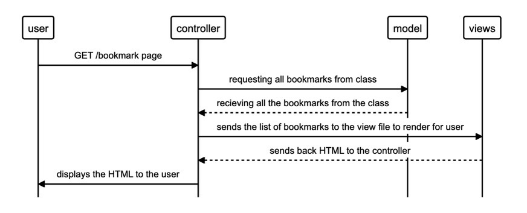

# bookmark-pair

``` 
As a user
To visit websites that I like quickly
I want to be able to see a list of all my created bookmarks 
```



To create the databases please refer to the migration folder within the db folder, there you can create databases for both production and testing using the same SQL line.